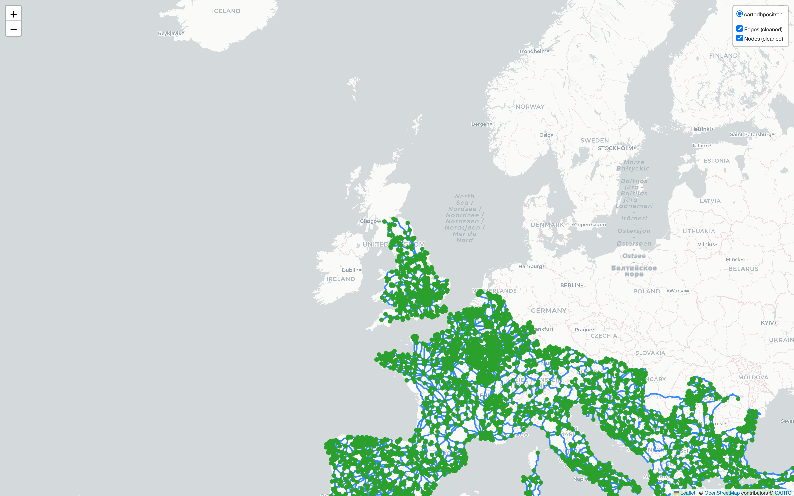
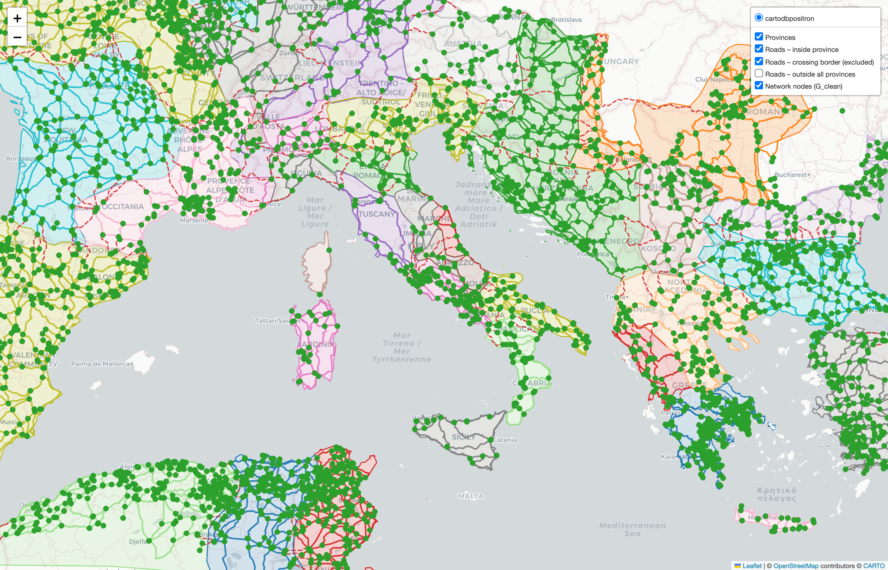

# itinereX

Builds a cleaned, analyzable road network graph from the itiner-E road dataset originally introduced by de Soto et al. (2025) [here](https://www.nature.com/articles/s41597-025-06140-z).

The goal of this repository is to take the source linework (often with near-miss junctions, duplicate endpoints, and degree-2 chains), rebuild a consistent topology, and export a weighted NetworkX graph that can be used for downstream analysis (routing, centrality, “important nodes”, etc.).

## What this repo produces

- An interactive **before/after** visualization of the network cleaning.
- A cleaned, noded topology with degree-2 simplification.
- A **time-weighted** graph export where each edge has `weight = time_s` (seconds) plus stable `node_id` / `edge_id` mappings.

## Cleaning schematic

## Interactive map
Open the hosted map on GitHub Pages:

- Map: https://nk173.github.io/itinereX/roads_after_cleaning.html

## Province overlay + sub-networks

The notebook also overlays Roman provinces (from `provinces/provinces.shp`) onto the cleaned network and partitions the graph into per-province sub-networks.

**How sub-networks are constructed**
- **Edge → province assignment:** each edge is assigned to the (most specific) province containing its midpoint; if the midpoint is not inside any polygon, the edge is assigned to the province with the longest overlap length.
- **Crossing edges (excluded):** an edge is marked as crossing if its start/end points fall in different provinces.
- **Outside edges (excluded):** an edge is outside if it cannot be assigned by midpoint or overlap fallback.
- **Per-province subgraph:** for each province, we filter `G_clean` to edges assigned to that province and build a subgraph from the incident nodes.

**Interactive province map**

- Map (GitHub Pages): https://nk173.github.io/itinereX/roads_with_provinces_nodes.html
- Map (local file): [roads_with_provinces_nodes.html](roads_with_provinces_nodes.html)

**Province-related outputs**
- [G_clean_weighted_edges_with_province.csv](G_clean_weighted_edges_with_province.csv): weighted edge list with `time_s` and province assignment (plus crossing/outside flags)
- [crossing_edges.geojson](crossing_edges.geojson): edges whose endpoints fall in different provinces
- [outside_provinces_edges.geojson](outside_provinces_edges.geojson): edges not assignable to any province
- [province_subnetworks.pkl](province_subnetworks.pkl): per-province NetworkX subgraphs + edge tables

## Network statistics

| Metric | Value |
|---|---:|
| nodes | 8460 |
| edges | 12849 |
| avg_degree | 3.0375886524822695 |
| avg_weighted_degree (sum of `weight` per node) | 167930.63592041272 (in seconds)|
| connected_components | 12 |
| largest_component_nodes | 7612 |
| largest_component_edges | 11693 |
| largest_component_fraction_of_nodes | 0.8997635933806146 |

## How to run

1. Open the notebook: [itinere-X_network.ipynb](itinere-X_network.ipynb)
2. Run the cells top-to-bottom.

Outputs:
- [roads_before_cleaning.html](roads_before_cleaning.html)
- [roads_after_cleaning.html](roads_after_cleaning.html)
- `G_clean_weighted_with_ids.pkl`

